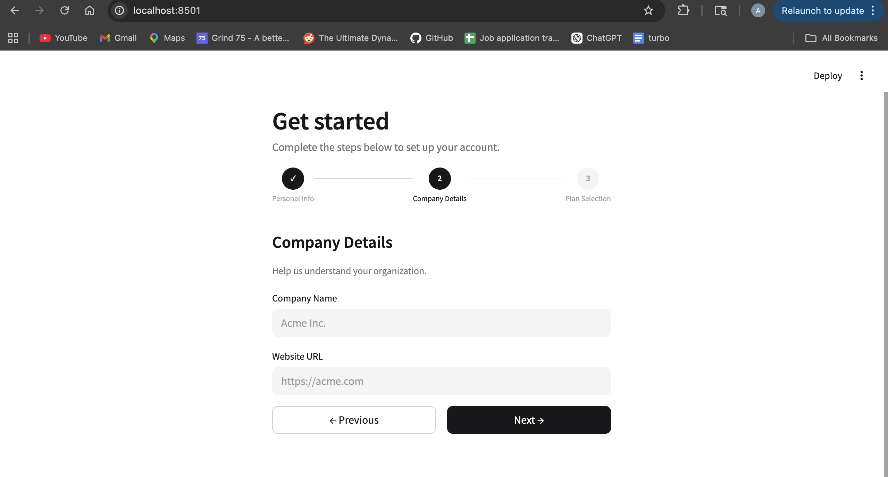
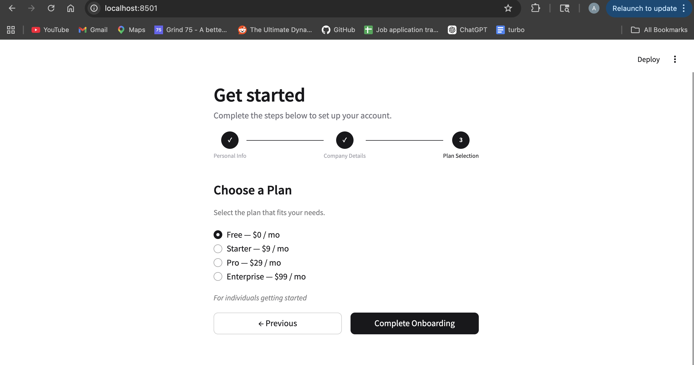
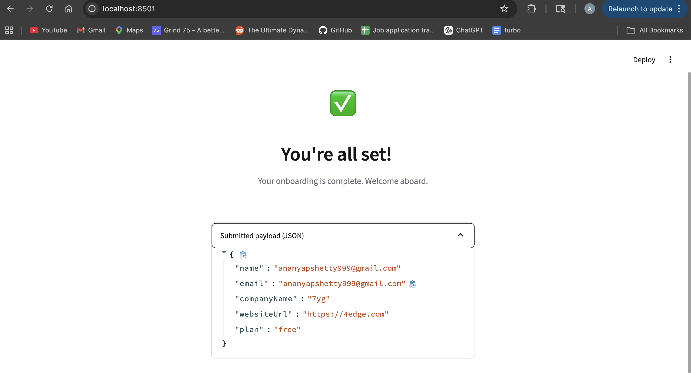

# Multi-Step Onboarding Form

A 3-step onboarding flow built with **Next.js 16** and **Streamlit**, featuring real-time validation, localStorage persistence, and a simulated HubSpot Server Action.

**Live demo (Streamlit):** http://localhost:8501

---

## Approach

The form is split into three isolated steps, each validated independently before advancing:

| Step | Fields | Validation |
|------|--------|------------|
| 1 — Personal Info | Name, Email | Required, valid email format |
| 2 — Company Details | Company Name, Website URL | Required, valid URL format |
| 3 — Plan Selection | Free / Starter / Pro / Enterprise | Must select one |

**Key design decisions:**

- **Schema-first** — a single Zod v4 schema (`lib/schema.ts`) drives both frontend validation and TypeScript types across all three steps, so there's one source of truth.
- **Per-step validation** — `react-hook-form`'s `trigger()` validates only the current step's fields on Next, so errors appear inline without submitting the whole form.
- **localStorage persistence** — a custom `useFormPersistence` hook syncs form state to localStorage on every keystroke. Refreshing the page restores progress automatically.
- **Server Action** — `submitToHubSpot` runs server-side (`"use server"`), simulates a 1.5s network delay, and returns a typed `{ success: true }` response. The loading state disables the submit button and shows "Submitting…" during the wait.

---

## Tech Stack

| Layer | Technology |
|-------|------------|
| Framework | Next.js 16 (App Router, Turbopack) |
| Styling | Tailwind CSS v4 |
| Forms | react-hook-form v7 + Zod v4 |
| Server | Next.js Server Actions |
| Alt frontend | Streamlit (Python) |

---

## Project Structure

```
onboarding-app/
├── app/
│   ├── actions.ts          # Server Action — submitToHubSpot
│   ├── page.tsx            # Root page
│   └── globals.css
├── components/onboarding/
│   ├── OnboardingForm.tsx  # Parent: step state, navigation, submit
│   └── steps/
│       ├── Step1PersonalInfo.tsx
│       ├── Step2CompanyDetails.tsx
│       └── Step3PlanSelection.tsx
├── lib/
│   ├── schema.ts           # Zod v4 schemas + TypeScript types
│   └── hooks/
│       └── useFormPersistence.ts  # localStorage sync hook
├── streamlit_app.py        # Streamlit frontend (Python)
├── requirements.txt
└── .streamlit/config.toml  # Light theme config
```

---

## Running Locally

### Next.js

Requires Node.js >= 20.9.0.

```bash
npm install
npm run dev
```

Open [http://localhost:3000](http://localhost:3000).

### Streamlit

```bash
pip install -r requirements.txt
streamlit run streamlit_app.py
```

Open [http://localhost:8501](http://localhost:8501).

---

### 📸 Visual Walkthrough

**1. Personal Info (Step 1)**


**2. Company Info (Step 2)**


**3. Plan Selection & Mock API Loading (Step 3)**


**4. Completion & State Cleared**


## Example Output

When the form is submitted, the following JSON payload is sent to the Server Action:

```json
{
  "name": "Ananya Praveen Shetty",
  "email": "ananyapraveen.shetty@sjsu.edu",
  "companyName": "7EDGE Pvt Ltd",
  "websiteUrl": "https://7edge.com",
  "plan": "pro"
}
```
